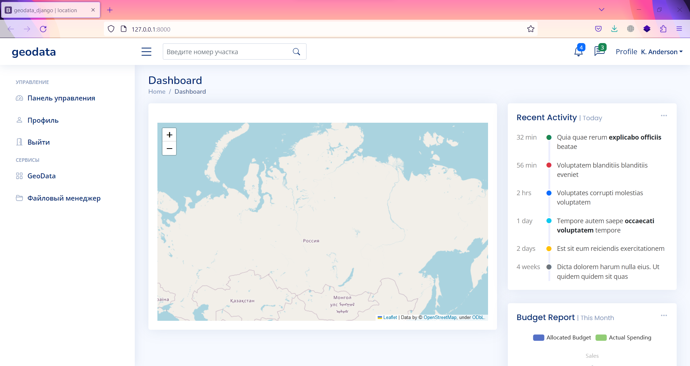
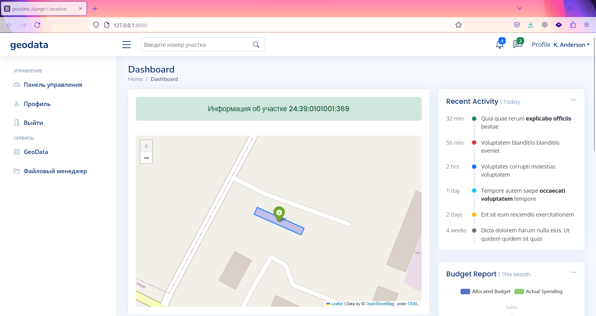

# test_task_geodata
Проект представляет собой web-приложение в котором по кадастровому номеру участка Вы можете увидеть его на карте OpenStreetMap

    

### Установка:
* Клонируйте репозиторий, используя команду в терминале `git clone https://github.com/alexeyvershinin/test_task_geodata.git` или загрузите архив по [ссылке](https://github.com/alexeyvershinin/test_task_geodata/archive/refs/heads/master.zip)
* Установите зависимости из файла `requirements.txt` используя  команду `pip install -r requirements.txt`
* Запустите локальный сервер командой `python manage.py runserver`

### Использованы библиотеки:
* Django 4.1.6
* rosreestr2coord 4.1.6
* folium 0.14.0
полный список зависимостей Вы найдете в `requirements.txt`
